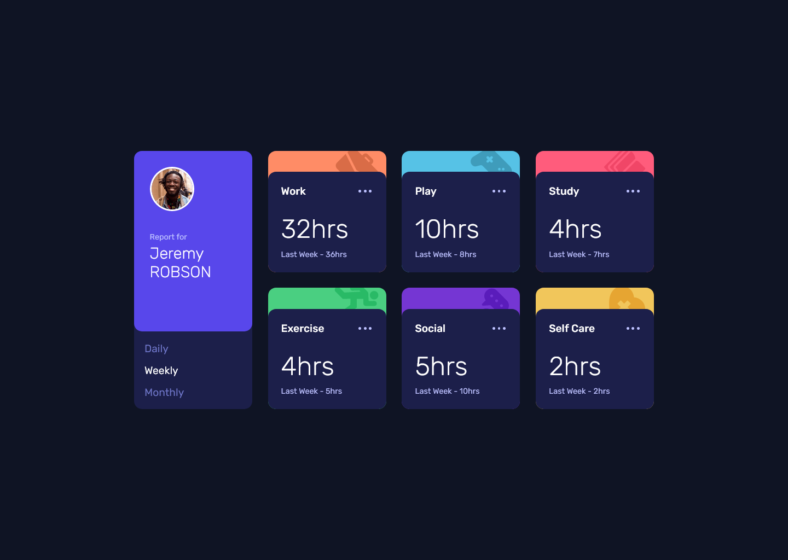
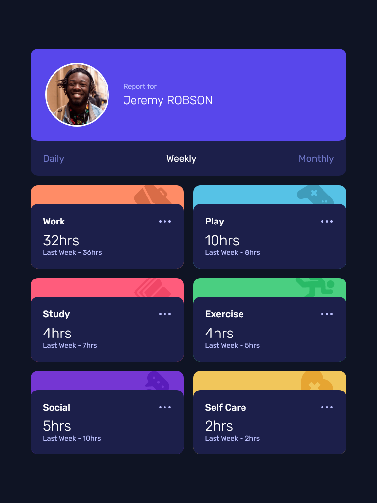
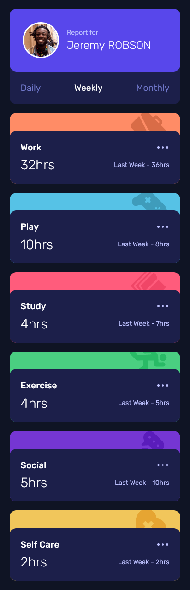

# Frontend Mentor - Time tracking dashboard solution

This is a solution to the [Time tracking dashboard challenge on Frontend Mentor](https://www.frontendmentor.io/challenges/time-tracking-dashboard-UIQ7167Jw). Frontend Mentor challenges help you improve your coding skills by building realistic projects.

## Table of contents

- [Overview](#overview)
  - [The challenge](#the-challenge)
  - [Screenshots](#screenshot)
  - [Links](#links)
- [My process](#my-process)
  - [Built with](#built-with)
- [Author](#author)

## Overview

### The challenge

Users should be able to:

- View the optimal layout for the site depending on their device's screen size
- See hover states for all interactive elements on the page
- Switch between viewing Daily, Weekly, and Monthly stats

### Screenshot

### Links

- Solution URL: [Add solution URL here](https://github.com/onurozbey/time-tracking-dashboard)
- Live Site URL: [Add live site URL here](https://onurozbey.github.io/time-tracking-dashboard/)

## My process

### Built with

- HTML
- CSS
- JS
- Fetch API

## Author

- GitHub - [Onur Özbey](https://github.com/onurozbey)
- Frontend Mentor - [@onurozbey](https://www.frontendmentor.io/profile/onurozbey)